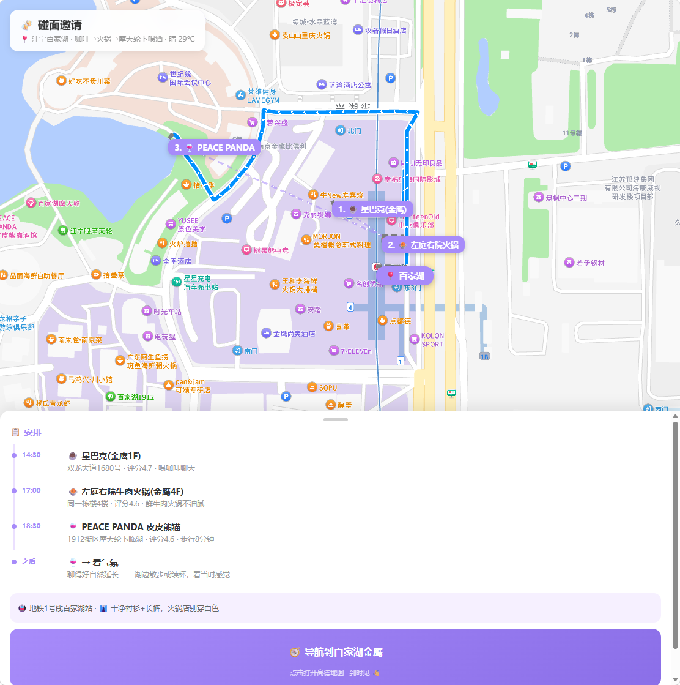
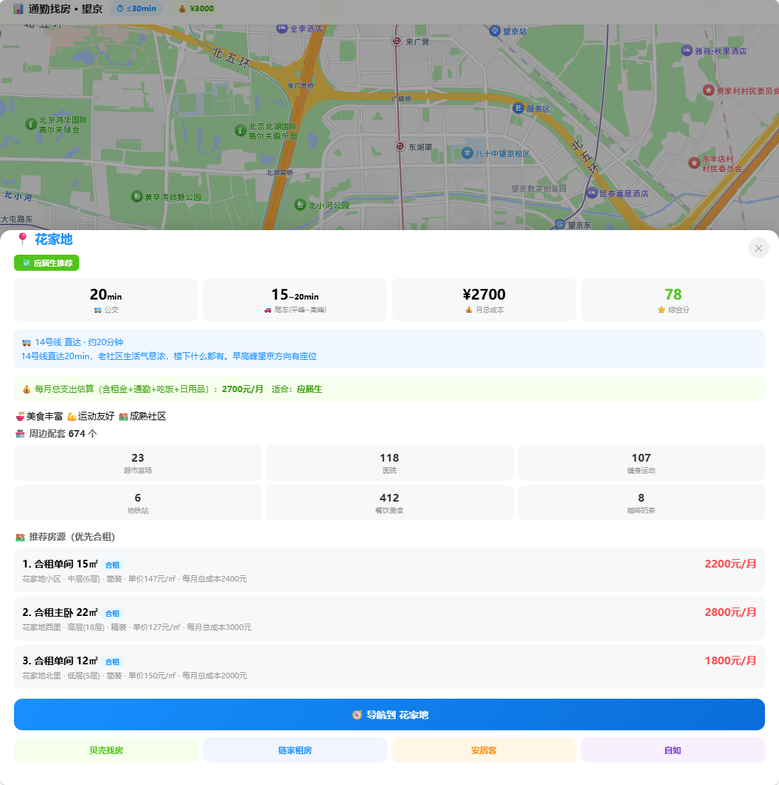
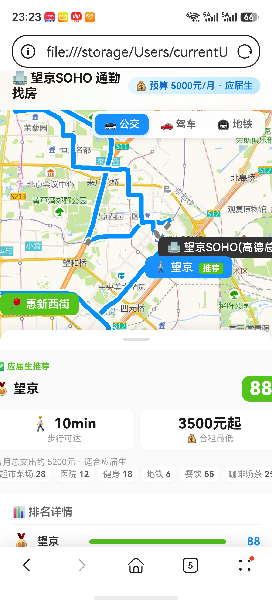
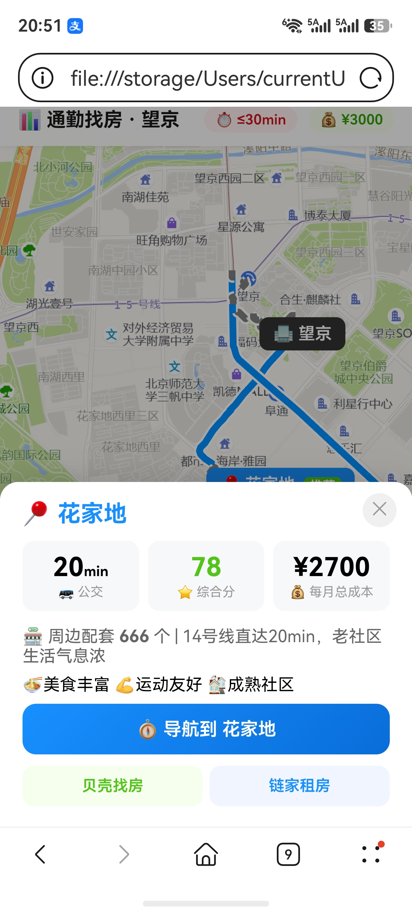
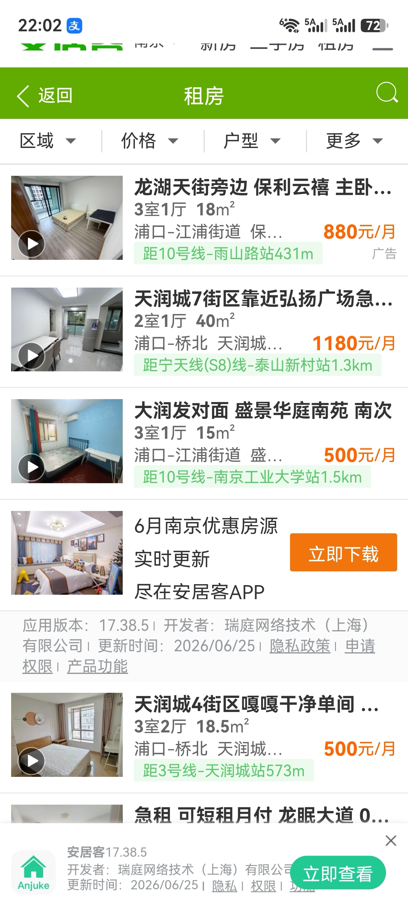

<div align="center">

# 🏠 通勤找房助手

**说一句话，30 秒拿到一份找房报告**

新到一个城市实习 / 入职 / 换工作，最头疼的不是找工作，是**找房子**——
不知道住哪、通勤多久、租金多少、地铁挤不挤、周边有没有吃的。

把这个 Skill 丢给 AI，你只需要说：

> *"我在望京上班，预算 5000，帮我找房"*

**30 秒后你会拿到：**
- 🥇 **Top 3 推荐区域**（附评分 + 通勤方式 + 每月总花费）
- 🏘️ **具体房源**（小区名 / 户型 / 面积 / 月租）
- 🔗 **一键跳转找房**（贝壳 / 链家 / 自如链接直接搜）
- 🗺️ **交互地图**（地铁线 + 区域标记 + 点击看详情，手机电脑都能用）

不用刷 10 个帖子、不用在地图上一个个量距离、不用算来算去——**一句话全搞定。**

[](https://lbs.amap.com/)
[]()

[中文](#中文) | [English](#english)

**中文**：[效果演示](#效果演示) · [实际示例](#实际示例) · [安装](#安装) · [使用](#使用) · [常见问题](#常见问题) · [项目结构](#项目结构)

**English**：[Demo](#demo) · [Real Examples](#real-examples) · [Install](#install) · [Usage](#usage) · [FAQ](#faq)

</div>

---

## 中文

### 效果演示

**电脑端 · 全图展示**：路线切换（公交/驾车/地铁）+ 区域标记 + 推荐标签

<p align="center">
  
</p>

**电脑端 · 细节展示**：通勤信息 + 每月总支出 + 合租房源 + 找房链接

<p align="center">
  
</p>

**手机端 · 全图展示**

<p align="center">
  
</p>

**手机端 · 细节展示**

<p align="center">
  
</p>

**手机端 · 房源链接**

<p align="center">
  
</p>

### 实际示例

两个真实场景，基于高德 API 实时数据生成：

| 场景 | 公司 | 预算 | 人群 | 推荐 | 示例文件 |
|------|------|------|------|------|----------|
| 🏢 北京望京 | 高德/阿里 | 3000元/月 | 一个人·应届 | 花家地 20min·合租单间 | [`examples/beijing-amap/`](examples/beijing-amap/) |
| 📱 南京小米 | 小米科技园 | 4000元/月 | 情侣·整租一居 | 油坊桥 32min·整租 | [`examples/nanjing-xiaomi/`](examples/nanjing-xiaomi/) |

每个示例包含：
- `report.md` — 推荐报告 + 原始 API 数据可复查
- `rental_areas.csv` — 区域对比表
- `rental_listings.csv` — 房源明细表
- `map.html` — 交互地图（公交/驾车切换 + 点击弹详情 + 手机安全区适配）

---

### 输出示例（南京小米 · 暑期实习生 · 预算 3000 元/月）

<details>
<summary>📄 点击展开完整报告</summary>

#### 不同人群推荐方案

| 人群 | 推荐区域 | 推荐房源 | 月租 | 每月总支出 | 理由 |
|------|----------|----------|------|------------|------|
| 🎓 暑期实习生 | 油坊桥 | 莲花新城 合租单间 15㎡ | 1000元 | ~1500元 | 地铁10min直达，最便宜 |
| 🎓 应届毕业生 | 奥体 | 仁恒江湾城 合租主卧 25㎡ | 2000元 | ~2800元 | 骑行到公司，不挤地铁 |
| 💼 换工作上班族 | 新街口 | 金鹰国际花园 合租主卧 22㎡ | 2200元 | ~3200元 | 配套最全，地铁直达 |
| 👫 情侣/整租 | 天润城 | 天润城 整租一居 40㎡ | 2500元 | ~3500元 | 整租独立空间 |

#### 🥇 奥体（骑行 8min · 应届生推荐）

> 每月总支出约 **3700 元** · 综合评分 82 分

| 户型 | 面积 | 月租 | 小区 | 装修 | 类型 | 月总成本 |
|------|------|------|------|------|------|----------|
| 合租主卧 | 25㎡ | 2000元 | 仁恒江湾城 | 精装 | 合租 | 2200元 |
| 合租单间 | 18㎡ | 1600元 | 万科光明城市 | 精装 | 合租 | 1800元 |
| 整租一居 | 40㎡ | 3200元 | 海峡城 | 精装 | 整租 | 3400元 |

通勤体验：骑行 8 分钟到小米，不依赖地铁，不怕迟到，加班无限制。

#### ④ 油坊桥（地铁 10min · 实习生首选）

> 每月总支出约 **2300 元** · 综合评分 75 分

| 户型 | 面积 | 月租 | 小区 | 装修 | 类型 | 月总成本 |
|------|------|------|------|------|------|----------|
| 合租单间 | 18㎡ | 1200元 | 油坊桥小区 | 简装 | 合租 | 1400元 |
| 合租主卧 | 22㎡ | 1500元 | 西善花苑 | 精装 | 合租 | 1700元 |
| 合租单间 | 15㎡ | 1000元 | 莲花新城 | 简装 | 合租 | 1200元 |

通勤体验：地铁 2 号线 10 分钟直达小米，始发站方向早高峰有座位。每月总支出仅 2300 元。

#### ⑤ 江宁大学城（公交 45min · 极致省钱）

> 每月总支出约 **1750 元** · 综合评分 72 分

| 户型 | 面积 | 月租 | 小区 | 装修 | 类型 | 月总成本 |
|------|------|------|------|------|------|----------|
| 合租单间 | 20㎡ | 800元 | 翠屏城 | 简装 | 合租 | 1000元 |
| 合租主卧 | 25㎡ | 1100元 | 托乐嘉 | 精装 | 合租 | 1300元 |
| 合租单间 | 18㎡ | 700元 | 天元城 | 简装 | 合租 | 900元 |

通勤体验：公交 45 分钟直达，大学城食堂便宜，每月总支出全南京最低。

#### 最终推荐

**实习生首选：④ 油坊桥（合租单间 15㎡ 1000元/月）**
- 每月总支出仅 2300 元，3 个月实习总花费 ~7000 元
- 地铁 10 分钟直达小米，通勤最短

**应届生首选：🥇 奥体（合租主卧 25㎡ 2000元/月）**
- 骑行 8 分钟到小米，不依赖地铁
- 精装主卧，居住环境好

**极致省钱：⑤ 江宁大学城（合租单间 18㎡ 700元/月）**
- 每月总支出仅 1750 元，全南京最低
- 大学城氛围好，适合实习生

</details>

<details>
<summary>📊 点击展开 CSV 数据预览（20 个区域）</summary>

| 排名 | 区域 | 维度 | 地铁线 | 通勤时间 | 换乘 | 合租参考租金 | 配套数 | 评分 | 画像标签 | 每月总成本 |
|------|------|------|--------|----------|------|-------------|--------|------|----------|------------|
| 1 | 奥体 | 步行/骑行 | 骑行8min | 8min | 0 | 2000元 | 120 | 82 | 💪运动友好 | 2200元 |
| 2 | 新街口 | 地铁 | 2号线 | 25min | 0 | 2200元 | 180 | 85 | 🍜美食丰富 ☕文艺氛围 | 2400元 |
| 3 | 河西中部 | 步行 | 步行15min | 15min | 0 | 1800元 | 95 | 78 | | 2000元 |
| 4 | 天润城 | 地铁 | 3号线→2号线 | 35min | 1 | 1000元 | 98 | 76 | 🍜美食丰富 🛒采购便利 | 1200元 |
| 5 | 油坊桥 | 地铁 | 2号线 | 10min | 0 | 1200元 | 76 | 75 | 🏘️成熟社区 | 1400元 |
| ... | ... | ... | ... | ... | ... | ... | ... | ... | ... | ... |
| 20 | 板桥 | 公交 | 公交直达 | 35min | 0 | 750元 | 60 | 65 | | 950元 |

完整 CSV 文件：[`examples/nanjing-xiaomi/rental_areas.csv`](examples/nanjing-xiaomi/rental_areas.csv)

</details>

---

### 安装

```bash
openclaw skills install @dongdongyue/amap-settle-guide
```

> 需要一个高德 API Key（免费），见下方 [环境变量](#环境变量)。

### 环境变量

| 变量名 | 必填 | 获取方式 |
|--------|------|----------|
| `AMAP_API_KEY` | ✅ | [高德开放平台](https://lbs.amap.com/) → 控制台 → 添加 Key → 类型选「Web 服务」 |
| `AMAP_JSAPI_KEY` | ❌ | 同上，类型选「Web端(JS API)」，用于交互地图 |
| `AMAP_SECURITY_JS_CODE` | ❌ | JS API 安全密钥 |

> 免费额度：5000 次/天，找房够用。

### 使用

```
"我在望京上班，帮我推荐住哪"              → 自动发现候选区域 + 推荐
"我在国贸上班，对比回龙观和天通苑"         → 评估指定区域
"我在西二旗上班，预算 4000"               → 带预算的推荐
"帮我生成一个地图"                       → 输出交互式 HTML 地图
```

### 常见问题

**Q: 推荐的区域我不满意怎么办？**
直接说"还有别的推荐吗"或"太远了，有没有近一点的"，助手会调整搜索范围重新推荐。

**Q: 支持哪些城市？**
全国有地铁的城市都支持。租金参考数据覆盖北上广深杭宁蓉汉 8 城，其他城市无租金对比但通勤和配套分析正常。

**Q: 找房链接打不开？**
链接跳转到贝壳/链家/自如的搜索页，按城市自动匹配。如果跳转不对，手动在租房 App 搜索区域名即可。

**Q: 需要装 Python 吗？**
不需要。本 Skill 是纯提示词驱动，AI 助手直接调用高德 HTTP API。`references/anjuke-scraper.md` 中的安居客抓取方案是可选的进阶功能，需要 DrissionPage 环境。

### 项目结构

```
amap-settle-guide/
├── README.md                      # 本文件
├── SKILL.md                       # Skill 定义
├── skill.json                     # 元数据
├── LICENSE                        # MIT 协议
├── .env.example                   # 环境变量模板
├── .gitignore
├── docs/                          # 截图 + 演示
│   ├── screenshot-map.png         # 电脑端全图
│   ├── screenshot-detail.png      # 电脑端细节
│   ├── mobile-map-link.jpg        # 手机端全图
│   ├── mobile-map-detail.jpg      # 手机端细节
│   └── mobile-map-detail-house-link-2.jpg  # 手机端房源链接
├── references/                    # 运行时模板
│   ├── html-template-commute.md   # 交互地图模板
│   ├── text-card-commute.md       # CSS 文字卡片模板
│   ├── rental-reference.md        # 8 城租金参考表
│   ├── anjuke-scraper.md          # 安居客抓取方案
│   └── social-rental-scraper.md   # 58同城/链家抓取方案
└── examples/                      # 示例输出 + 演示
    ├── beijing-amap/              # 北京高德
    ├── shenzhen-dji/              # 深圳大疆
    └── nanjing-xiaomi/            # 南京小米
```

### 调用的高德 API

| API | 用途 |
|-----|------|
| `geocode/geo` | 地名 → 坐标 |
| `place/around` | 周边 POI 搜索 |
| `place/text` | 地铁站搜索 |
| `direction/driving` | 驾车路线 |
| `direction/transit/integrated` | 公交路线 |

---

## English

### The Problem

You just got an internship / new job in a city you don't know. You need to find an apartment — but you have no idea which neighborhoods are livable, how long the commute is, or what rent actually costs.

### The Fix

Drop this Skill into your AI assistant and say:

> *"I work at Wangjing, budget ¥5000/mo, help me find a place"*

**30 seconds later you get:**
- 🥇 **Top 3 recommended areas** with scores, commute method, and monthly total cost
- 🏘️ **Specific listings** — community name, layout, size, rent
- 🔗 **One-click rental links** — Beike / Lianjia / Ziroom search pages
- 🗺️ **Interactive map** — metro lines, area markers, click-for-details, works on mobile

No scrolling through 10 forum posts. No measuring distances on a map. No spreadsheet math. **One sentence, done.**

### Demo

**Desktop · Full Map** — route switching (transit/driving/metro), area markers, and recommendation badges.

<p align="center">
  
</p>

**Desktop · Detail View** — commute info, monthly cost breakdown, shared housing listings, and rental links.

<p align="center">
  
</p>

**Mobile · Full Map**

<p align="center">
  
</p>

**Mobile · Detail View**

<p align="center">
  
</p>

**Mobile · Housing Links**

<p align="center">
  
</p>

### Real Examples

Three complete scenarios with report, CSV data, and interactive map:

| Scenario | Company | Budget | Price Range | Files |
|----------|---------|--------|-------------|-------|
| 🏢 Beijing Amap | Wangjing SOHO | ¥5000/mo | ¥1500-6500 | [`examples/beijing-amap/`](examples/beijing-amap/) |
| 🚁 Shenzhen DJI | Sky City | ¥4000/mo | ¥800-5000 | [`examples/shenzhen-dji/`](examples/shenzhen-dji/) |
| 📱 Nanjing Xiaomi | Jianye Tech Park | ¥3000/mo | ¥700-3500 | [`examples/nanjing-xiaomi/`](examples/nanjing-xiaomi/) |

<details>
<summary>📄 Sample output (Nanjing Xiaomi · Intern · ¥3000/mo budget)</summary>

**Top Recommendations:**

| User Type | Area | Commute | Rent | Monthly Total | Why |
|-----------|------|---------|------|---------------|-----|
| 🎓 Intern | Youfangqiao | Metro 10min | ¥1000 | ~¥1500 | Cheapest, direct metro |
| 🎓 Graduate | Olympic | Bike 8min | ¥2000 | ~¥2800 | No metro needed |
| 💼 Worker | Xinjiekou | Metro 25min | ¥2200 | ~¥3200 | Best amenities |
| 👫 Couple | Tianruncheng | Metro 35min | ¥2500 | ~¥3500 | Whole apartment |

**Best for interns: Youfangqiao (shared room 15㎡ ¥1000/mo)**
- Monthly total: only ¥2300, 3-month internship costs ~¥7000
- Metro Line 2, 10min direct to Xiaomi

**Best value: Olympic (shared master bedroom 25㎡ ¥2000/mo)**
- Bike 8min to Xiaomi, no metro dependency
- Premium community, great living environment

</details>

### Install

```bash
openclaw skills install @dongdongyue/amap-settle-guide
```

> Requires a free Amap API Key. See [Environment Variables](#environment-variables).

### Environment Variables

| Variable | Required | How to get it |
|----------|----------|---------------|
| `AMAP_API_KEY` | ✅ | [Amap Open Platform](https://lbs.amap.com/) → Console → Add Key → type: 「Web Service」 |
| `AMAP_JSAPI_KEY` | ❌ | Same, type: 「Web(JS API)」 — for interactive maps |
| `AMAP_SECURITY_JS_CODE` | ❌ | JS API security code |

> Free tier: 5,000 calls/day.

### Usage

```
"I work at Wangjing, recommend where to live"              → auto-discover areas + recommend
"I work at Guomao, compare Huilongguan vs Tiantongyuan"    → evaluate specific areas
"I work at Xierqi, budget 4000"                            → budget-aware recommendations
"Generate a map for me"                                    → interactive HTML map output
```

### Amap APIs Used

| API | Usage |
|-----|-------|
| `geocode/geo` | Place name → coordinates |
| `place/around` | Nearby POI search |
| `place/text` | Metro station search |
| `direction/driving` | Driving routes |
| `direction/transit/integrated` | Transit routes |

### FAQ

**Q: What if I don't like the recommended areas?**
Just say "any other recommendations?" or "too far, anything closer?" — the assistant will adjust.

**Q: Which cities are supported?**
All cities with metro systems. Rental reference data covers Beijing, Shanghai, Guangzhou, Shenzhen, Hangzhou, Nanjing, Chengdu, Wuhan. Other cities still get commute and amenity analysis.

**Q: Do I need to install Python?**
No. This Skill is pure prompt-driven — the AI assistant calls Amap's HTTP API directly. The Anjuke scraper in `references/anjuke-scraper.md` is an optional advanced feature that requires DrissionPage.

### Project Structure

```
amap-settle-guide/
├── README.md                      # This file
├── SKILL.md                       # Skill definition
├── skill.json                     # Metadata
├── LICENSE                        # MIT License
├── .env.example                   # Environment variable template
├── .gitignore
├── docs/                          # Screenshots & demos
│   ├── screenshot-map.png         # Desktop full map
│   ├── screenshot-detail.png      # Desktop detail view
│   ├── mobile-map-link.jpg        # Mobile full map
│   ├── mobile-map-detail.jpg      # Mobile detail view
│   └── mobile-map-detail-house-link-2.jpg  # Mobile housing links
├── references/                    # Runtime templates
│   ├── html-template-commute.md   # Interactive map template
│   ├── text-card-commute.md       # CSS text card template
│   ├── rental-reference.md        # 8-city rental reference
│   ├── anjuke-scraper.md          # Anjuke scraper
│   └── social-rental-scraper.md   # 58.com / Lianjia scraper
└── examples/                      # Sample outputs
    ├── beijing-amap/              # Beijing Amap
    ├── shenzhen-dji/              # Shenzhen DJI
    └── nanjing-xiaomi/            # Nanjing Xiaomi
```

---

## 📝 License

MIT
